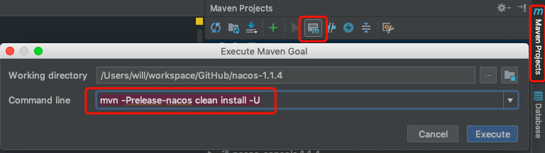
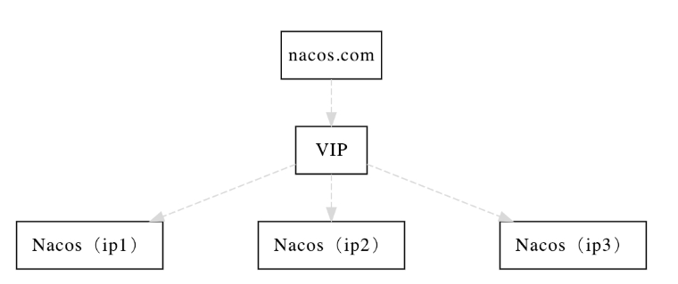
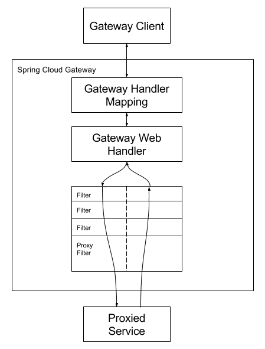

# springcloud

> + 参考资料
>   + [驰狼课堂springcloud视频教程](http://www.chilangedu.com/course/1606928230.html) 
> + [B站尚硅谷springcloud视频](https://www.bilibili.com/video/av22613028) 
>   
> + 前置知识：
>   + [Docker](../docker/README.md) 
>   + rancher

## 版本

+ `springboot`与`springcloud`之间存在版本对应关系，创建项目时，选择好`springboot`版本后，在选择其他组件时，就会自动匹配合适的`springcloud`版本

## Eureka

### 介绍

+ 用于服务注册发现
+ 分为服务端和客户端，服务端用于管理有哪些可用的服务，客户端用于将自己注册到服务端

### server

+ 创建moudle时选择`eureka`服务的server端

   

  这会自动引入如下依赖
  
  ```xml
  <dependency>
      <groupId>org.springframework.cloud</groupId>
      <artifactId>spring-cloud-starter-netflix-eureka-server</artifactId>
  </dependency>
  ```
  
+ 在启动类上增加`@EnableEurekaServer`注解，将该项目作为`eureka server`启动

+ `application.properties`

  ```properties
  server.port=20001
  spring.application.name=cloud-customer
  
  eureka.instance.prefer-ip-address=true
  eureka.instance.instance-id=${spring.cloud.client.ip-address}:${server.port}
  # 指定集群中所有eureka server节点
  eureka.client.service-url.defaultZone=http://localhost:10000/eureka
  ```

  > 很多课程会在本节课将`eureka.client.register-with-eureka`和`eureka.client.fetch-registry`设置为`false`；如果不设置，单个`eureka server`服务启动时，只能自己把自己注册到自己身上，但是在启动过程中会有几次注册不上，会产生几次报错，尝试几次就能注册上了；我觉得问题不大，可以不用设置

+ 启动项目，并访问http://localhost:10000，即可看见`springcloud`提供的集群中各节点信息管理界面

   

  + **DS Replicas**

    全称`discovery server replicas`，译为`发现服务副本`

    这里显示的内容，取决于`eureka.client.service-url.defaultZone`的配置，如该配置项配置为：

    ```properties
    eureka.client.service-url.defaultZone=http://peer1:10000/eureka,http://peer1:10001/eureka,http://peer2:10000/eureka
    ```

    则此处会显示2个副本：`peer1`，`peer2`，点击`peer1`时，会跳转带`peer1`主机上其中1个服务地址上

  + **Instances currently registered with Eureka**

    当前在集群的eureka服务上注册的所有实例

    + application

      该列显示每个实例的应用名称，可以通过`spring.application.name`和`eureka.instance.appname`进行配置，前者优先级更高

    + status

      该列显示每个实例的`instance ID`和实例状态

  + **General Info**

    当前实例基本状况

  + **Instancce Info**

    实例信息

### client

+ 创建`module`并选择`eureka`服务的client端

   

  这会自动引入如下依赖

  ```xml
  <dependency>
      <groupId>org.springframework.cloud</groupId>
      <artifactId>spring-cloud-starter-netflix-eureka-client</artifactId>
  </dependency>
  ```

+ 配置文件

  ```properties
  server.port=20001
  spring.application.name=cloud-customer
  
  eureka.instance.prefer-ip-address=true
  eureka.instance.instance-id=${spring.cloud.client.ip-address}:${server.port}
  # 指定集群中所有eureka server节点
  eureka.client.service-url.defaultZone=http://localhost:10000/eureka
  ```

### 配置文件

+ **spring.application.name**

  指定实例名称（优先级较高）；**推荐使用**

  这个必须指定，服务间通过实例名称找到对方

+ **eureka.instance.appname**

  指定实例名称（优先级较低）

+ **eureka.instance.prefer-ip-address**

  集群中各服务之间互相访问默认使用hostname进行，但是这样需要在各个机器上配置`hosts`文件，将该配置设为true，可以尽量使用`ip`进行通信

+ **eureka.instance.hostname**

  用于指定本机的主机名，当前实例以主机名的形式向外暴露地址时，主机名使用该值

  （初步觉得使用ip地址更好，该选项应该用不到）

+ **eureka.client.fetch-registry**

  是否从`eureka server`上获取信息

+ **eureka.client.register-with-eureka**

  是否注册到`eureka server`上

+ **eureka.client.serviceUrl.defaultZone**

  用于设置集群中所有`eureka server`节点的服务地址

+ **eureka.instance.instance-id**

  用于设置`Instance ID`

  `Instance ID`默认取值为：

  ```properties
  # 主机名;应用名:端口
  eureka.instance.instance-id=${spring.cloud.client.hostname}:${spring.application.name}:${server.port}}
  ```

  我们可以自行指定：

  ```properties
  # ip:port
  eureka.instance.instance-id=${spring.cloud.client.ip-address}:${server.port}
  ```

  这个`Instance ID`目前为止知道的作用仅是显示

### 简单的服务调用

+ 配置`RestTemplate`

  ```java
  @Bean
  public RestTemplate restTemplate(){
      return new RestTemplate();
  }
  ```

+ 服务提供方

  正常写接口

  ```java
  @RestController
  @RequestMapping("/user")
  public class UserController {
      @GetMapping("/name")
      public String getUserName(){
          return "tom";
      }
  }
  ```

+ 服务调用方

  ```java
  @Resource
  private EurekaClient eurekaClient;
  @Resource
  private RestTemplate restTemplate;
  
  @GetMapping("/customer/name")
  public String getCustomerName(){
      // 从eureka获取服务的地址
      InstanceInfo instanceInfo = eurekaClient.getNextServerFromEureka("cloud-producer", false);
      String homePageUrl = instanceInfo.getHomePageUrl();
      // 组装请求
      return restTemplate.getForObject(homePageUrl + "/user/name", String.class);
  }
  ```

### @EnableDiscoveryClient和@EnableEurekaClient

两者功能差不多，如果服务发现使用的是`eureka`，则使用`@EnableEurekaClient`，否则使用`@EnableDiscoveryClient`

## Nacos

### 介绍

+ `eureka`已停止更新，替代方案选择`nacos`
+ `c/s`模型，服务端下载后直接启动
+ 集成了服务注册发现、配置中心的功能

### server端

#### 编译源码

> 目前最新版本为`1.1.4`，但是该版本要使用`mysql8.0`需要修改源码

+ 下载地址：https://github.com/alibaba/nacos/releases，下载最新``Release`版本的源码

+ 修改源码

  + 将父`pom`中mysql版本修改为`8.0.19`

  + 修改`MysqlHealthCheckProcessor.java`

    ```java
    import com.mysql.jdbc.jdbc2.optional.MysqlDataSource;
    // 修改为
    import com.mysql.cj.jdbc.MysqlDataSource;
    ```

  + 修改`distribution/release-nacos.xml`文件

    ```xml
    <outputDirectory>/target/</outputDirectory>
    <!-- 修改为 -->
    <outputDirectory>./target/</outputDirectory>
    ```

  + 在右侧`Maven Project`中点击`Excute Maven Goal`，输入`mvn -Prelease-nacos -Dmaven.test.skip=true clean install -U`，点击`Excute`进行打包

     

  + 编译成功后将`./distribution/target/nacos-server-xxx.zip`文件拷出，该文件就是运行时需要使用的文件

+ 解压后目录介绍

  + bin：脚本目录

    + startup.cmd、startup.sh：启动脚本
    + shutdown.cmd、shutdown.sh：停止脚本

  + config

    + application.properties

      配置文件

    + application.properties.example

      其他配置项示例，需要使用时将对应的配置项配置在`application.properties`中

    + cluster.conf.example：

      集群配置项示例，需要使用时去掉`.example`即可

    + nacos-logback.xml

      日志配置

    + nacos-mysql.sql

      `mysql`数据库脚本

    + schema.sql

      `Derby`数据库脚本

  + target

    + nacos-server.jar

      服务jar包

#### 准备

+ 创建数据库

  > 默认nacos将数据存储在内存（derby）中，但是这样每次重启都需要重新配置，所以建议使用mysql存储数据

  + 创建数据库
  + 执行`nacos-mysql.sql`脚本

+ 配置mysql

  `application.properties`配置文件中增加如下配置

  ```properties
  # mysql
  spring.datasource.platform=mysql
  db.num=1
  db.url.0=jdbc:mysql://127.0.0.1:3306/nacos_devtest?useUnicode=true&characterEncoding=utf8&autoReconnect=true&failOverReadOnly=false&useSSL=false&useTimezone=true&serverTimezone=GMT%2B8
  db.user=root
  db.password=rootroot
  ```

  注：最好使用主从备份数据库，或高可用数据库

#### 部署模式

##### 单机模式

使用如下命令启动：

```bash
$ ./startup.sh -m standalone
```

##### 集群部署

+ nacos服务端集群架构图（`域名+VIP`模式）

   

  其中`VIP`指的是`nginx`这种代理工具，实现原理是：

  > 使用`nginx`代理域名`nacos.com`，在`nginx`中配置负载均衡，将请求分发到不同的`nacos`服务端

+ 要求

  + 最好3个以上nacos服务端节点
  + 必须使用`mysql`

+ 部署流程

  + 配置`cluster.conf`，配置各节点`ip:port`

    不能使用`localhost`或`127.0.0.1`

    ```conf
    192.168.28.130:8848
    192.168.28.130:8849
    192.168.28.130:8850
    ```

  + 使用`./startup.sh`启动各个`nacos`服务端节点

  + 配置`nginx`

    ```json
    upstream nacos {
        server 192.168.28.130:8848;
        server 192.168.28.130:8849;
        server 192.168.28.130:8850;
    }
    
    server {
        listen 80;
    
        server_name test.nacos.com;
    
        location / {
            proxy_pass http://nacos;
        }
    }
    ```

  + 配置`host`文件将上述域名指向该`nginx`服务器的ip

+ 使用

  + 此时，客户端就可以通过该域名找到`nacos`服务端集群中的1个节点了

  + 个人观点

    每台机器都需要配置`host`文件很麻烦，客户端使用nginx服务器的ip当做nacos服务端，nginx中将自己的IP分发到不同的节点

##### 多集群部署

> 暂时用不到

#### 概念

+ 命名空间

  用来区分测试环境、生产环境

+ 服务

  每种服务，包括很多个相同的服务实例，这些实例可能来自不同的集群（机房）

+ 分组

  就是单纯的把1个服务中的所有实例进行一下分组

+ 集群

  可以理解为机房

+ 服务实例

  每个启动的jar包就是1个服务实例

+ 保护阈值

  保护阈值的范围是0~1
  服务的健康比例=服务的健康实例/总实例个数
  当服务健康比例<=保护阈值时候，无论实例健不健康都会返回给调用方
  当服务健康比例>保护阈值的时候，只会返回健康实例给调用方

+ 权重

  数值0~100，数值越大，分配的机会越大
  
+ 服务路由方式

  *暂不了解*

+ 元数据

  *暂不了解*

#### 管理页面

> 访问：http://localhost:8848/nacos，即可访问管理界面，默认用户名密码都是`nacos`

+ 配置管理

  + 配置l列表

    用于管理配置文件

  + 历史版本

    所有配置的发布记录都在这里

  + 监听查询

    查看哪些机器在使用指定的配置

+ 服务管理

  + 服务列表

    用于展示客户端信息

  + 订阅者列表

    在`服务名称`中输入服务提供者的`服务名`，点击查询，即可查看该服务被哪些服务调用了

+ 命名空间

  用于配置有哪些环境，如生产、测试

+ 集群管理

  用于展示都有哪些nacos服务端节点

### 客户端

#### 依赖

+ 使用`alibaba cloud`都需要在`dependencyManagement`引入如下依赖

  ```xml
  <dependency>
    <groupId>com.alibaba.cloud</groupId>
    <artifactId>spring-cloud-alibaba-dependencies</artifactId>
    <version>2.1.1.RELEASE</version>
    <type>pom</type>
    <scope>import</scope>
  </dependency>
  ```

+ 如需使用配置中心功能，引入如下依赖

  ```xml
  <dependency>
    <groupId>com.alibaba.cloud</groupId>
    <artifactId>spring-cloud-starter-alibaba-nacos-config</artifactId>
  </dependency>
  ```

+ 如需使用服务注册发现功能，引入如下依赖

  ```xml
  <dependency>
    <groupId>com.alibaba.cloud</groupId>
    <artifactId>spring-cloud-starter-alibaba-nacos-discovery</artifactId>
  </dependency>
  ```

#### 配置文件

如果使用了配置中心功能，则必须配置在`bootstrap.properties`文件中，否则可以使用`application.properties`文件

```properties
# 不能使用localhost 或 127.0.0.1
spring.cloud.nacos.server-addr=192.168.1.204:8848
```

增加该配置后即可使用nacos提供的功能

### 服务发现

#### 配置

使用`spring.cloud.nacos.discovery.xxx`进行配置

#### 服务端重启能否自动注册

集群模式启动时可以

### 配置中心

#### 使用配置

+ nacos客户端使用`dataId`寻找自己要使用的配置

+ `dataId` 的完整格式如下：

  ```
  ${prefix}-${spring.profile.active}.${file-extension}
  ```

  - `prefix` 默认为 `spring.application.name` 的值，也可以通过配置项 `spring.cloud.nacos.config.prefix`来配置。
  - `spring.profile.active` 即为当前环境对应的 profile，**当 `spring.profile.active` 为空时，对应的连接符 `-` 也将不存在，dataId 的拼接格式变成 `${prefix}.${file-extension}`**
  - `file-exetension` 为配置内容的数据格式，可以通过配置项 `spring.cloud.nacos.config.file-extension` 来配置。目前只支持 `properties` 和 `yaml` 类型。

#### 配置

使用`spring.cloud.nacos.config.xxx`进行配置

#### @RefreshScope

+ 范围

  使用`@Value`等注解引用了配置文件中配置的地方，类上或方法上可以使用该注解

+ 作用

  不使用该注解，当配置修改时，应用仍然使用原来的值；使用该注解后，运行的代码中使用了配置文件中的配置时会主动去刷新最新的配置

#### 灰度配置

+ 什么叫灰度配置
+ 如何配置
  + 在`编辑配置`时，点击`更多高级选项`，勾选`Beta发布`，输入ip（逗号分隔），编辑好配置，点击`发布Beta`，即可将该配置发布到指定的机器
  + 完成`Beta发布`后，`发布Beta`按钮会变为`停止发布Beta`，点击`停止发布Beta`即可停止，所有配置恢复
  + 如果过程中点击发布，则将配置发布到所有机器

### *TODO 服务监控*

> 这块没弄明白，有时间需要好好学学`prometheus`和`Grafana`

#### nacos开启prometheus支持

`application.properties`配置文件中配置

```properties
management.endpoints.web.exposure.include=*
```

访问`{ip}:8848/nacos/actuator/prometheus`，看是否能访问到metrics数据

#### prometheus

+ 介绍

  + 用于采集各个应用的数据
  + 自身也具备图形化界面等功能，功能很强大，不过有一定难度，可以先使用`Grafana`，熟练后再过度到`prometheus`
  + 下载地址：https://prometheus.io/download/
    + mac：darwin版本

+ 配置启动

  + 修改`prometheus.yml`

    ```yml
    metrics_path: '/nacos/actuator/prometheus'
    static_configs:
    	- targets:['{ip1}:8848','{ip2}:8848','{ip3}:8848']
    ```

  + 启动

    ```bash
    $ ./prometheus --config.file="prometheus.yml"
    ```

+ 访问

  通过访问`http://{ip}:9090/graph`，搜索`nacos_monitor`可以看到prometheus的采集数据

#### Grafana

+ 介绍

  + 也是服务监控软件，比`普罗米修斯`简单一些
  + 默认端口`3000`，默认账号密码`admin`

+ 安装启动

  参见：https://grafana.com/docs/grafana/latest/

+ 


## Ribbon

### 介绍

用于服务间负载均衡

### 使用

+ 依赖

  `eureka`的`server`和`client`端依赖中均包含了`ribbon`的依赖，这里不需要单独引入

+ 在声名`RestTemplate`的bean上加上`@LoadBalanced`注解

  只有需要使用`RestTemplete`调用服务时才需要这个配置，并且必须使用`@LoadBalanced`，使用`Feign`调用时不用配置这个

  ```java
  @Bean
  @LoadBalanced
  public RestTemplate restTemplate(){
    return new RestTemplate();
  }
  ```

+ 此时，`restTemplate`就具备了根据应用名称请求服务和负载均衡的能力

  ```java
  @Resource
  private RestTemplate restTemplate;
  
  @GetMapping("/customer/name")
  public String getCustomerName(){
    // 其中 cloud-producer 是服务提供者的应用名称
    return restTemplate.getForObject("http://cloud-producer/user/name", String.class);
  }
  ```

### Ribbon主要组件

#### IRule

指定负载均衡策略

**内置7种算法：**

> 根据我认为的从最差到最好的顺序进行排序，后3个应该不相上下，一般使用默认即可

+ **RandomRule**

  随机规则

+ **RoundRobinRule**

  轮训规则

+ **ReryRule**

  重试（先按照轮询规则获取服务，如果获取服务失败则在指定时间内进行重试)

+ **AvailabilityFilteringRule**

  先过滤掉不可用或处于高并发状态的服务，然后进行轮询

+ **WeightedResponseTimeRule**

  根据响应时间计算权重，选择响应最快的服务

  刚启动时因为统计信息不足，会先使用轮训策略

+ **BestAvailableRule**

  先过滤掉由于多次访问故障而处于断路器跳闸状态的服务，然后选择一个并发量最小的服务

+ **ZoneAvoidanceRule**

  ==默认规则==

  复合判断Server所在区域的性能和Server的可用性选择服务器

#### IPing

如何检查应用是否还活着

**内置5种实现**

+ **NoOpPing**

  永远返回true

+ **PingConstant**

  指定什么就返回什么

+ **DummyPing**

  ==默认实现==

  也是永远返回true

+ **NIWSDiscoveryPing**

  不执行真正的ping，以服务发现客户端认为的状态为准

+ **PingUrl**

  执行真正的ping，以ping命令的结果为准

#### ServerList

用于获取服务列表

**内置4种实现**

+ **StaticServerList**

  静态服务列表

+ **ConfigurationBasedServerList**

  从配置文件中获取服务列表

  ```properties
  <clientName>.ribbon.listOfServers=www.microsoft.com:80,www.yahoo.com:80,www.google.com:80
  ```

+ **DiscoveryEnabledNIWSServerList**

  从Eureka Client中获取服务列表。此值必须通过属性中的VipAddress来标识服务器集群

+ **DomainExtractingServerList**

  代理类，根据ServerList的值实现具体的逻辑

  ==默认实现是使用该类代理DiscoveryEnabledNIWSServerList== 

#### ServerListFilter

对服务列表进行过滤

**内置4实现**

+ **ZoneAffinityServerListFilter**

  过滤掉所有的不和客户端在相同zone的服务，如果和客户端相同的zone不存在，才不过滤不同zone有服务

+ **DefaultNIWSServerListFilter**

  跟`ZoneAffinityServerListFilter`一模一样，重写了，但是没有重写任何方法

+ **ZonePreferenceServerListFilter**

  ==默认实现==

  `ZoneAffinityServerListFilter`的子类。和``ZoneAffinityServerListFilter`相似，但是比较的zone是发布环境里面的zone。过滤掉所有和客户端环境里的配置的zone的不同的服务，如果和客户端相同的zone不存在，才不进行过滤。

+ **ServerListSubsetFilter**

  `ZoneAffinityServerListFilter`的子类。此过滤器确保客户端仅看到由ServerList实现返回的整个服务器的固定子集。 它还可以定期用新服务器替代可用性差的子集中的服务器。

#### ServerListUpdater

用于动态的更新服务列表。

**内置2种实现**

+ **PollingServerListUpdater**

  ==默认实现==

  启动一个定时线程池，定时（默认30s）执行更新策略

+ **EurekaNotificationServerListUpdater**

  当收到缓存刷新的通知，会更新服务列表。

#### IClientConfig

用于定义包括上述5种组件的配置信息

目前只有1个实现：**DefaultClientConfigImpl**

#### ILoadBalancer

负载均衡调度器，用于使用上面配置的5种组件统一进行调度

**内置4种实现**

+ **NoOpLoadBalancer**

  不做任何操作的调度器（不用管，谁会用这样的调度器）

+ **BaseLoadBalancer**

+ **DynamicServerListLoadBalancer**

  组合Rule、IPing、ServerList、ServerListFilter、ServerListUpdater 实现类，实现动态更新和过滤更新服务列表

+ **ZoneAwareLoadBalancer**

  ==默认实现== 

  这是DynamicServerListLoadBalancer的子类，主要加入zone的因素。统计每个zone的平均请求的情况，保证从所有zone选取对当前客户端服务最好的服务组列表

### 如何进行的默认配置

+ 在`RibbonClientConfiguration`中使用`ZoneAvoidanceRule`配置了1个类型为`IRule`的Bean，但是经过测试，这个Bean并不是启动的时候就加载的，是在调用了`restTemplate`之后才加载
+ 经过debug发现，调用`restTemplate.getForObject`方法后，执行了`SpringClientFactory`的父类`NamedContextFactory`的`createContext`方法（108行）；在该类中维护了1个用于维护**应用上下文**的Map集合，key是要请求的服务的应用名，value是请求该服务时使用的应用上下文，而每个服务使用的负载均衡策略（类型为`IRule`的bean）就被注册到了这些上下文中。这些上下文与`applicationContext`是独立的，所以，是无法在代码中使用`@Resource`注入的。

### 配置Ribbon

+ 全局

  + 注解

    使用`@RibbonClients`注解的`defaultConfiguration`属性配置（不仅限于IRule）

    ```
    @RibbonClients(defaultConfiguration = BestAvailableRule.class)
    ```

  + 配置类

    被应用上下文扫描到的，关于ribbon相关的Bean会被作为默认配置

    ```java
    @Bean
    public IRule iRule(){
      return new BestAvailableRule();
    }
    ```

+ 为每个单独配置

  + 注解

    使用`@RibbonClient`为1个应用指定配置（不仅限于IRule）

    ```java
    @RibbonClient(value = "cloud-producer",configuration = BestAvailableRule.class)
    ```

    当需要为多个应用指定时，需要与`@RibbonClients`注解结合使用

    ```java
    @RibbonClients(defaultConfiguration = WeightedResponseTimeRule.class,
            value = {
                    @RibbonClient(value = "cloud-producer", configuration = BestAvailableRule.class)
            })
    ```

    **注意：如果需要单独定义配置某个应用的Ribbon配置时，不要被应用上下文扫描到（不要放在可扫描包下，或使用`@Configuration`等注解），否则会作为全局配置**

  + 配置文件

    ribbon相关配置可以通过`<clientName>.<nameSpace>.<property>`进行配置，其中：

    clientName：应用名称

    nameSpace：ribbon配置使用的命名空间（专用的应用上下文），默认`ribbon`

    property：可以配置的属性

    + NFLoadBalancerClassName：
    + NFLoadBalancerRuleClassName
    + NFLoadBalancerPingClassName
    + NIWSServerListClassName
    + NIWSServerListFilterClassName

    举个🌰：

    ```properties
    # 配置负载均衡策略
    <clientName>.ribbon.NFLoadBalancerRuleClassName=com.netflix.loadbalancer.BestAvailableRule
    ```

## Feign

### 介绍

声名式远程服务调用，用于使用注解调用远程接口

### 使用

+ 引入依赖

  也可在创建项目时选择`openfeign`

  ```xml
  <dependency>
    <groupId>org.springframework.cloud</groupId>
    <artifactId>spring-cloud-starter-openfeign</artifactId>
  </dependency>
  ```

+ 在启动类上增加`@EnableFeignClients`注解，启用feign功能

+ 使用`@FeignClient`注解对其他服务提供的接口进行声名

  ```java
  /**
   * @author shuyan
   */
  @FeignClient("cloud-producer")
  public interface UserFeignClient {
      /**
       * 获取用户名
       * @return 用户名
       */
      @GetMapping("/user/name")
      String getUserName(@RequestParam("id") Integer id);
  }
  ```

+ 调用服务

  ```java
  @Resource
  private UserFeignClient userFeignClient;
  
  @GetMapping("/customer/name")
  public String getCustomerName(){
    return userFeignClient.getUserName(1);
  }
  ```

  **注意：使用`FeignClient`传递参数时，必须使用`@RequestParam`等注解对请求参数进行标注，pojo类必须使用`@RequestBody`进行标注（包括get请求）；并且可以指定参数名称的，必须指定参数名称（如：`@RequestParam("id")`）** 

### @FeignClient注解

+ 只能作用在接口或类上

+ 属性

  + name

    指定应用名称

  + value

    `name`属性的别名

  + serverId

    与`name`属性作用相同，已弃用

  + contextId

    当项目中存在两个同类名的`FeignClient`时，会以相同的bean名称进行注册，此时会报错：

    ```java
    The bean 'cloud-producer.FeignClientSpecification' could not be registered. A bean with that name has already been defined and overriding is disabled.
    Action:
    Consider renaming one of the beans or enabling overriding by setting spring.main.allow-bean-definition-overriding=true
    ```

    此时可以使用该属性将这个bean指定为其他名称，即可避免冲突

  + qualifier

    使用该属性指定1个值后，使用`@Qualifier`注解进行注入时，可以使用该值注入

  + url

    url属性一般用于调试程序，允许我们手动指定@FeignClient调用的地址

  + decode404

    默认情况下，当从1个接口调用1个不存在的服务时，那个服务返回404，这个接口返回的是500

    当`decode404`设置true时，会对服务返回的信息进行解析，如果服务返回404，则接口也返回404

    使用此功能需要配置`feign`的`decoder`

  + configuration

    用于单独指定这个`feignClient`的配置类

  + fallBack

    定义容错的处理类，当调用远程接口失败或超时时，会调用对应接口的容错逻辑，fallback指定的类必须实现@FeignClient标记的接口，并且注册到`spring`容器中

  + fallbackFactory

    用于生成fallback类示例，通过这个属性我们可以实现每个接口通用的容错逻辑，减少重复的代码

  + path

    指定路径的统一前缀，对应controller上面的`@RequestMapping`指定的路径

  + primary

    是否作为主bean，应该是bean出现冲突时使用的，先不管他

### @RequestLine

不建议使用

+ 作用

  指定声名的接口的请求方法及路径

  ```java
  @RequestLine("GET /user/info")
  # 相当于
  @GetMapping("/user/info")
  ```

+ 需要全局配置`Contract`

  ```java
  @Bean
  public Contract contract(){
    // 这样配置后，只能使用 @RequestLine 注解了
    return new feign.Contract.Default();
  }
  ```

### FeignClient相关组件

> 参考资料：[feign自定义组件（2）](https://blog.csdn.net/haozhishang/article/details/93882865) 

#### Encoder

用于编码如何向**请求体**中封装请求，默认`SpringEncoder`，默认就好

#### Decoder

当响应状态码为**2xx**时，将响应转为需要的类型的对象

默认实现：

```java
new OptionalDecoder(new ResponseEntityDecoder(new SpringDecoder(this.messageConverters)))
```

这种链式构造，目的是当`OptionalDecoder`无法解码时，使用`ResponseEntityDecoder`解码，再无法解码时，使用`SpringDecoder`解码

#### LogLevel

+ 默认实现类：Slf4jlogger

+ 日志级别

  NONE：不做任何记录（默认）

  BASIC：只记录输出Http 方法名称、请求URL、返回状态码和执行时间

  HEADERS：记录输出Http 方法名称、请求URL、返回状态码和执行时间 和 Header 信息

  FULL：记录Request 和Response的Header，Body和一些请求元数据

#### Contract

用于将接口中定义的注解、参数等转换为http协议需要的元数据

默认实现：`SpringMvcContract`

#### Retryer

重试器，当HTTP请求出现IO异常时，Feign会有一个最大尝试次数发送请求

默认实现：`Retryer.NEVER_RETRY`

#### ErrorDecoder

当响应状态码不是**2xx**时，将响应转为`Exception`异常

默认实现：`ErrorDecoder.Default`

#### RequestInterceptor

+ 作用

  请求拦截器，用于在请求发出之前，对请求进行配置

+ 实现类

  + BaseRequestInterceptor

    定义了addHeader方法，往requestTemplate添加非重名的header

  + FeignAcceptGzipEncodingInterceptor

    + 用于告诉服务提供者，你可以使用指定的压缩哟格式对响应进行压缩再回传
    + 继承了BaseRequestInterceptor，它的apply方法往RequestTemplate添加了名为`Accept-Encoding`，值为gzip,deflate的header
    + 原理参见`Accept-Encoding`请求头作用

  + FeignContentGzipEncodingInterceptor

    + 告诉服务提供者，我使用指定的格式对请求进行了压缩
    + 继承了BaseRequestInterceptor，其apply方法先判断是否需要compression，即mimeType是否符合要求以及content大小是否超出阈值，需要compress的话则添加名为`Content-Encoding`，值为gzip,deflate的header
    + 具体在哪进行的压缩暂时未找到

  + BasicAuthRequestInterceptor

    + 使用指定的用户名密码，使用Basic认证的方式生成`Authorization`请求头

+ 配置文件启用压缩

  使用`feign.compression`相关配置

+ 自定义`RequestInterceptor`传递请求头

  ```java
/**
  * 将接收到的 X-Auth-Token 请求头传递下去
  */
  @Bean
  public RequestInterceptor headerInterceptor() {
    return requestTemplate -> {
      ServletRequestAttributes attributes = (ServletRequestAttributes) RequestContextHolder
        .getRequestAttributes();
      if (attributes == null) {
        return;
      }
      HttpServletRequest request = attributes.getRequest();
      String token= request.getHeader("X-Auth-Token");
      if (!StringUtils.isEmpty(token)) {
        requestTemplate.header("X-Auth-Token", token);
      }
    };
  }
  ```

### 配置feign

#### 配置类

+ 全局

  直接在配置类中声名Bean

+ 单独

  在没有被扫描进`application context`的类中声名bean

  ```java
  public class MyFeignClientConfiguration {
  
      @Bean
      public Retryer retryer(){
          return new Retryer.Default();
      }
  }
  ```

  使用`@FeignClient`的`configuration`属性指定该客户端的配置

  ```java
  @FeignClient(value = "provider",path = "/user",configuration = MyFeignClientConfiguration.class)
  ```

#### 配置文件

源码参见`FeignClientProperties`，可配置属性都在这里

+ 全局：使用`feign.default`进行配置
+ 单独：使用`feign.<clientName>`进行配置

#### 配置加载顺序

参见`FeignClientFactoryBean.configureFeign()`方法

```java
protected void configureFeign(FeignContext context, Feign.Builder builder) {
		FeignClientProperties properties = this.applicationContext
				.getBean(FeignClientProperties.class);
		if (properties != null) {
             /**
              * 下面主要是设值的优先级
              */
			if (properties.isDefaultToProperties()) {
                 //先将子容器中存在bean设入builder中
				configureUsingConfiguration(context, builder);
                 //加载默认的属性值替换刚刚设入builder的值
				configureUsingProperties(
						properties.getConfig().get(properties.getDefaultConfig()),
						builder);
                 //加载对应contextId(这个就是@FeignClient里面的contextId属性)的配置替换刚刚设入builder的值
				configureUsingProperties(properties.getConfig().get(this.contextId),
						builder);
			}
			else {
                 //同上
				configureUsingProperties(
						properties.getConfig().get(properties.getDefaultConfig()),
						builder);
				configureUsingProperties(properties.getConfig().get(this.contextId),
						builder);
				configureUsingConfiguration(context, builder);
			}
		}
		else {
			configureUsingConfiguration(context, builder);
		}
	}
```

### 调用流程

 

### 指定feign扫描包路径

+ 当需要将`@FeignClient`标注的接口类抽离出来时，由于跨包，无法被应用上下文扫描到

+ 但是由于`@FeignClient`标注的是接口，无法实例化，所以使用常规的`@ComponentScan`注解指定扫描路径，是无效的

+ 此时可以使用`@EnableFeignClients`注解指定扫描路径

  ```java
  @EnableFeignClients("com.learn.cloud.common.feign")
  ```

### Feign类型转换器

```java
@Component
public class FeignFormatterRegister implements FeignFormatterRegistrar {

    @Override
    public void registerFormatters(@NonNull FormatterRegistry registry) {
        registry.addConverter(Instant.class, String.class, new Instant2StringConverter());
    }

    private class Instant2StringConverter implements Converter<Instant,String> {
        @Override
        public String convert(@NonNull Instant source) {
            return source.toString();
        }
    }
}
```

### 全局Fallback

> 参见：https://blog.csdn.net/ttzommed/article/details/90669320

代码参见例程中：

+ `FunFeignFallback`
+ `FunFallbackFactory`
+ `FunSentinelFeign`
+ `FunSentinelInvocationHandler`
+ `FunFeignFallbackConfiguration`

### 踩坑记录

#### GET请求使用Pojo类传递参数报405

加入如下依赖

```xml
<dependency>
  <groupId>io.github.openfeign</groupId>
  <artifactId>feign-httpclient</artifactId>
</dependency>
```

#### Date传参相差14小时

+ 问题

  get请求直接使用请求参数传递Date类型请求参数时，接到的时间会相差14小时，而使用pojo类传参则不会

+ 解决方案

  注册1个类型转换器，指定如何将Date类型转换为字符串，参见[Feign类型转换器](# Feign类型转换器) 

  另外建议使用`Instant`传递时间，而不是`Date`

## Sentinel

### 介绍

+ 由于`Hystrix`已停止更新，需要使用其他产品替换，`Hystrix`官方推荐`resilience4j`，但是很多人选择了`Alibaba`的`Sentinel`，对比3者的`github`星数，果断选择`sentinel`

  + hystrix：18.8k
  + resilience4j：4.8k
  + sentinel：10.2k

+ 断路器

  上述3种中间件都是断路器

  如果A服务出现问题，B服务请求A服务，则B服务也会阻塞住，C调用B时，C也会阻塞住，这样造成`雪崩`效应，导致整个集群瘫痪

  熔断器的作用就是，当1个服务不可用时，即时放弃请求，避免蔓延到整个集群
  
+ 限流器

  对同一个id的资源请求过多时，可以根据qps进行限流

### 依赖

```xml
<dependency>
    <groupId>com.alibaba.cloud</groupId>
    <artifactId>spring-cloud-starter-alibaba-sentinel</artifactId>
</dependency>
```

### 控制台

#### 使用

+ 下载地址：https://github.com/alibaba/Sentinel/releases

  下载`sentinel-dashboard-xxx.jar`

+ 启动命令

  ```bash
  nohup java -Dserver.port=8719 -Dcsp.sentinel.dashboard.server=localhost:8080 -Dproject.name=sentinel-dashboard -jar sentinel-dashboard-1.7.0.jar &
  ```

  修改端口从启动命令中修改

  启动后即可访问控制台所在服务器ip+指定的端口访问控制台，默认账号密码都是`sentinel`

+ 应用接入控制台

  cloud应用中`application.properties`

  ```properties
  # 控制台下发指令的接口
  spring.cloud.sentinel.transport.port=8719
  # 控制台地址
  spring.cloud.sentinel.transport.dashboard=172.20.10.2:8080
  ```

#### *TODO 讲解*

> 参见：https://github.com/alibaba/Sentinel/wiki/%E6%8E%A7%E5%88%B6%E5%8F%B0

### 资源

#### 介绍

+ 资源，可以是任何东西，服务，服务里的方法，甚至是一段代码
+ 资源定义好之后，才可以对资源进行限流、降级等操作

#### 定义资源（埋点）

+ 默认

  sentinel默认为所有的接口提供了埋点

+ 使用`@SentinelResource`注解定义资源

  用于对不是接口的方法埋点，仅限于被`spring`管理的`Bean`中的方法
  
  ```java
@Service
  public class ClerkServiceImpl implements ClerkService {
  
      @Override
      @SentinelResource("test")
      public void test() {
          System.out.println("测试埋点");
      }
  }
  ```
  

#### BlockException

资源被限流时，会抛出该异常

#### @SentinelResource

+ value

  资源名称，必须指定

+ entryType

  IN：入口流量，调用该资源的流量

  OUT：出口流量，该资源调用其他资源的流量

  部分规则的判断会区分流量类型

+ resourceType

  资源类型

  *没找到什么资料，先不管*

+ blockHandler

  函数名称，用于处理被限流后，处理`BlockException`的方法名

  + 若未配置，将向上抛

  + 必须为`public`

  + 返回值类型必须与原方法匹配

  + 参数类型需要与原方法匹配，`并`最后多出1个`BlockException`类型的参数

  + `blockHandler`函数默认需要和原方法在同一个类中

    如果你不想让异常处理方法跟业务方法在同一个类中，可以使用`blockHandlerClass`指定处理该异常的类，此时对应的函数必需为`static`函数

+ blockHandlerClass

  用于配置使用哪个类中的方法处理`BlockException`

+ fallback

  函数名称，除`BlockException`和`exceptionsToIgnore`指定的异常以外的所有异常，都可以使用该方法处理

  + 若未配置，将向上抛

  + 返回值类型必须与原方法匹配
  + 参数类型需要与原方法匹配，`或`最后多出1个`Exception`类型的参数
  + 默认需要和原方法在同一个类中。若希望使用其他类的函数，则可以指定`fallbackClass`为对应的类的 Class 对象，注意对应的函数必需为 static 函数

+ defaultFallback

  + 作用与`fallback`相同，不过优先级比`fallback`要低
  + 指定得方法可以无参或只有异常参数

+ fallbackClass

  指定`fallback`方法所在类

+ exceptionsToTrace

  处理哪些异常

+ exceptionsToIgnore

  忽略哪些异常

#### 配置资源

+ 单独配置

  使用`@SentinelResource`注解

+ 全局

  + blockhandler

    实现`UrlBlockHandler`接口，并注册为`Bean`

    ```java
    @Component
    public class MyUrlBlockHandler implements UrlBlockHandler {
        @Override
        public void blocked(HttpServletRequest httpServletRequest, HttpServletResponse httpServletResponse, BlockException e) throws IOException {
            httpServletResponse.setContentType("application/json;charset=UTF-8");
            httpServletResponse.setStatus(HttpStatus.TOO_MANY_REQUESTS.value());
            httpServletResponse.getWriter().write("已被限流");
        }
    }
    ```

  + fallback

    + 目前没找到全局的`fallback`配置

    + 但是可以使用`@SentinelResource`注解的`defaultFallback`和`fallbackClass`属性使用同一个方法处理

### *TODO 规则*

> 参见：https://github.com/alibaba/Sentinel/wiki/%E5%A6%82%E4%BD%95%E4%BD%BF%E7%94%A8

#### 流量控制规则

> 参见：https://github.com/alibaba/Sentinel/wiki/%E6%B5%81%E9%87%8F%E6%8E%A7%E5%88%B6

+ 属性
  + resource：资源名称
  + grade：限流阈值类型，QPS 模式（1）或并发线程数模式（0）；默认QPS模式
  + count：限流阈值
    + QPS模式下，设置的是每秒查询率
    + 并发线程模式下，设置的是并发线程数
  + limitApp：流控针对的调用来源
    + default：不区分来源
    + {applicationName}：针对该来源，填应用名称
    + other：针对其他来源
  + strategy：调用关系限流策略

#### 熔断降级规则

#### 系统保护规则

#### 来源访问控制规则

#### 热点参数规则

### 生产环境

+ 规则持久化

  + 介绍

    + 将`sentinel`与`nacos`结合，使用`nacos`数据源持久化规则
    + 针对每种规则可以同时持久化到多个数据源
    + 但是每种规则需要单独配置

  + 用法

    引入依赖

    ```xml
    <dependency>
      <groupId>com.alibaba.csp</groupId>
      <artifactId>sentinel-datasource-nacos</artifactId>
    </dependency>
    ```

    应用中进行如下配置

    ```properties
    spring.cloud.sentinel.datasource.<ruleType>.nacos.server-addr=${spring.cloud.nacos.server-addr}
    spring.cloud.sentinel.datasource.<ruleType>.nacos.dataId=${spring.application.name}-sentinel
    spring.cloud.sentinel.datasource.ds.nacos.rule-type=flow
    ```

    + 其中`<ruleType>`可以是任意字符串，但是我觉得这里使用规则名称区分更好
    + 配置后，在`nacos`配置管理中新增名称为`${spring.application.name}-sentinel`的配置，使用json配置规则，即可生效，并被持久化；使用`sentinel`控制台配置的，是没办法持久化的

+ TODO 监控资源访问日志

  >  参见：https://github.com/alibaba/Sentinel/wiki/%E5%9C%A8%E7%94%9F%E4%BA%A7%E7%8E%AF%E5%A2%83%E4%B8%AD%E4%BD%BF%E7%94%A8-Sentinel#%E7%9B%91%E6%8E%A7

### RestTemplete支持

+ 声名`RestTemplete`的`blockhandler`

  ```java
  @Bean
  @LoadBalanced
  @SentinelRestTemplate(blockHandler = "handleException", blockHandlerClass = ExceptionUtil.class)
  public RestTemplate restTemplate() {
      return new RestTemplate();
  }
  ```

+ 异常处理类

  ```java
  public class ExceptionUtil {
      public static SentinelClientHttpResponse handleException(HttpRequest request, byte[] body, ClientHttpRequestExecution execution, BlockException ex) {
          return new SentinelClientHttpResponse("RestTemplate FallBack Msg");
      }
  }
  ```

### Feign支持

+ 引入依赖

  ```xml
  <dependency>
    <groupId>org.springframework.cloud</groupId>
    <artifactId>spring-cloud-starter-openfeign</artifactId>
  </dependency>
  ```

+ 配置文件

  ```properties
  feign.sentinel.enabled=true
  ```

### Gateway支持

> 参见：https://github.com/alibaba/Sentinel/wiki/%E7%BD%91%E5%85%B3%E9%99%90%E6%B5%81

+ 在gateway项目中引入如下依赖

  ```xml
  <dependency>
    <groupId>com.alibaba.cloud</groupId>
    <artifactId>spring-cloud-alibaba-sentinel-gateway</artifactId>
  </dependency>
  ```

+ bootstrap.yml

  ```yml
  spring:
      cloud:
          nacos:
              server-addr: 192.168.1.204:8848
          sentinel:
              transport:
                  dashboard: 192.168.1.204:8080
  ```

+ application.yml

  ```yml
  spring:
      cloud:
          sentinel:
              datasource:
                  ds:
                      nacos:
                          dataId: ${spring.application.name}-sentinel
                          rule-type: flow
                          server-addr: ${spring.cloud.nacos.server-addr}
              filter:
              		enabled: false
              scg:
              		fallback:
              				content-type: application/json;charset=UTF-8
              				mode: response
              				response-body: "{\"time\":\"2019-12-15T08:29:49.041Z\"}"
  ```

+ 增加配置类

  ```java
  @Configuration
  public class SentinelSupportConfig {
  
      @PostConstruct
      public void doInit() {
          // 定义资源分组
          initCustomizedApis();
          // 定义限流规则
          initGatewayRules();
      }
  
      private void initCustomizedApis() {
          Set<ApiDefinition> definitions = new HashSet<>();
          ApiDefinition api = new ApiDefinition("all_api")
                  .setPredicateItems(new HashSet<ApiPredicateItem>() {
                      private static final long serialVersionUID = -2458126303494500338L;
                      {
                      add(new ApiPathPredicateItem().setPattern("/**")
                              .setMatchStrategy(SentinelGatewayConstants.URL_MATCH_STRATEGY_PREFIX));
                  }});
          definitions.add(api);
          GatewayApiDefinitionManager.loadApiDefinitions(definitions);
      }
  
      private void initGatewayRules() {
          Set<GatewayFlowRule> rules = new HashSet<>();
          rules.add(new GatewayFlowRule("all_api")
                  .setCount(1)
                  .setIntervalSec(1)
          );
          GatewayRuleManager.loadRules(rules);
      }
  }
  ```

## Gateway

### 依赖

```xml
<dependency>
  <groupId>org.springframework.cloud</groupId>
  <artifactId>spring-cloud-starter-gateway</artifactId>
</dependency>
```

### 概念

+ Route（路由）

  这是网关的基本构建块。它由一个 ID，一个目标 URI，一组断言和一组过滤器定义。如果断言为真，则路由匹配。

+ Predicate（断言）

  这是一个`Java8`的`Predicate`。输入类型是一个``ServerWebExchange`。我们可以使用它来匹配来自 HTTP 请求的任何内容，例如 headers 或参数。

+ Filter（过滤器）

  `GatewayFilter`的实例，我们可以使用它修改请求和响应。

### 工作原理

 

+ 请求进入`Gateway Handler Mapping`之后，根据`Predicate`匹配请求
+ 如果匹配成功，将请求交给`Gateway Web Handler`
+ `Gateway Web Handler`将请求经过过滤器链，然后将请求发给目标`url`

### 配置路由

> 配置路由可以通过`yml`配置，也可以通过`Bean`配置
>
> 推荐使用`yml`配置，可以通过配置中心修改

#### 配置文件

只有在`配置Bean`中能使用`与或非`逻辑

```yml
spring:
  cloud:
    gateway:
      routes: # 下面可以配置多个路由
      - id: neo_route # 这组路由id,默认值是UUID
        uri: http://www.ityouknow.com # 转发地址
        order: 1  # 优先级，默认0，值越小越优先
        predicates: # 匹配规则集合（断言）
        - Path=/spring-cloud/**
```

#### 注册

只有在`配置Bean`中能使用`与或非`逻辑

```java
@Bean
public RouteLocator myRoutes(RouteLocatorBuilder builder) {
  return builder.routes()
    .route(p -> p
           .path("/get/**") 
           .uri("http://www.baidu.com"))
    .build();
}
```

#### 参数说明

+ id：路由id，可以不指定，默认生成1个UUID
+ uri：目标服务的uri，必须指定，指定的内容仅限于uri，不可以包含路径（包含了也没用，还是会提取出uri替换请求网关的url中的uri）
  + 这里可以指定具体的服务uri，如：`http://localhost:10200`
  + 也可以以`lb://{serverId}`的形式指定服务名称
+ order：优先级，默认0，值越小越优先
+ predicates：断言数组

### 断言

`Predicate`是java8提供的方法，可以用于组装与或非判断

`springcloud`提供了`RoutePredicateFactory`接口，基于该接口内置了以下几大类实现类

#### 时间匹配

##### AfterRoutePredicateFactory

+ 介绍

  匹配某时间后发来的请求

+ yml

  ```yml
  spring:
    cloud:
      gateway:
        routes:
         - id: time_route
          uri: http://ityouknow.com
          predicates:
           - After=2018-01-20T06:06:06+08:00[Asia/Shanghai]
  ```

##### BeforeRoutePredicateFactory

+ 介绍

  匹配某时间之前发来的请求

+ yml

  ```yml
  spring:
    cloud:
      gateway:
        routes:
         - id: after_route
          uri: http://ityouknow.com
          predicates:
           - Before=2018-01-20T06:06:06+08:00[Asia/Shanghai]
  ```

##### BetweenRoutePredicateFactory

+ 介绍

  匹配某段时间内发来的请求

+ yml

  ```yml
  spring:
    cloud:
      gateway:
        routes:
         - id: after_route
          uri: http://ityouknow.com
          predicates:
           - Between=2018-01-20T06:06:06+08:00[Asia/Shanghai], 2019-01-20T06:06:06+08:00[Asia/Shanghai]
  ```

#### Cookie匹配

+ 介绍

  `CookieRoutePredicateFactory`接受两个参数：

  第1个：cookie的name

  第2个：正则表达式，用于匹配cookie的value

+ yml

  ```yml
  spring:
    cloud:
      gateway:
        routes:
         - id: cookie_route
           uri: http://ityouknow.com
           predicates:
           - Cookie=ityouknow, kee.e
  ```

#### Header匹配

`HeaderRoutePredicateFactory`同cookie匹配

#### Host匹配

+ 介绍

  `HostRoutePredicateFactory`接收一组参数，一组匹配的域名列表

+ yml

  ```yml
  spring:
    cloud:
      gateway:
        routes:
        - id: host_route
          uri: http://ityouknow.com
          predicates:
          - Host=**.ityouknow.com
  ```

#### 请求方法匹配

+ 介绍

  `MethodRoutePredicateFactory`请求方法匹配

+ yml

  ```yml
  spring:
    cloud:
      gateway:
        routes:
        - id: method_route
          uri: http://ityouknow.com
          predicates:
          - Method=GET,POST
  ```

#### 请求路径匹配

+ 介绍

  `PathRoutePredicateFactory`请求路径匹配

+ yml

  ```yml
  spring:
    cloud:
      gateway:
        routes:
        - id: host_route
          uri: http://ityouknow.com
          predicates:
          - Path=/foo/{segment}
  ```

#### URL参数匹配

+ 介绍

  `QueryRoutePredicateFactory`根据url中请求参数匹配，接受2个参数

  第1个：请求参数名；只有1个参数时表示只要有这个参数即匹配成功

  第2个：正则表达式，与属性值匹配

+ yml

  ```yml
  spring:
    cloud:
      gateway:
        routes:
        - id: query_route
          uri: http://ityouknow.com
          predicates:
          - Query=smile
  ```

#### IP匹配

+ 介绍

  `RemoteAddrRoutePredicateFactory`根据IP地址匹配

+ yml

  ```yml
  spring:
    cloud:
      gateway:
        routes:
        - id: remoteaddr_route
          uri: http://ityouknow.com
          predicates:
          - RemoteAddr=192.168.1.1/24
  ```

#### 请求体匹配

#### 服务名匹配

+ 介绍

  `CloudFoundryRouteServiceRoutePredicateFactory`根据服务名称匹配

  传了如下请求头，即匹配成功

  ```java
  /**
  	 * Forwarded URL header name.
  	 */
  public static final String X_CF_FORWARDED_URL = "X-CF-Forwarded-Url";
  
  /**
  	 * Proxy signature header name.
  	 */
  public static final String X_CF_PROXY_SIGNATURE = "X-CF-Proxy-Signature";
  
  /**
  	 * Proxy metadata header name.
  	 */
  public static final String X_CF_PROXY_METADATA = "X-CF-Proxy-Metadata";
  ```

#### 权重匹配

### 过滤器

+ GatewayFilter

  + 用于一组路由

  + 也可以使用`spring.cloud.gateway.default-filters`配置到全局，此时与`GlobalFilter`效果就是一样的了，因为这个特性，我觉得自定义的时候全都使用`GatewayFilter`即可

  + 需要在配置文件中进行配置生效，或将过滤器注册到`RouteLocator`中

+ GlobalFilter

  + 用于所有路由

  + 声明为`Bean`即可生效

#### GatewayFilter

`GatewayFilter`接口的实现类都是路由过滤器

##### 配置过滤器

+ 注册

  ```java
  @Bean
  public RouteLocator myRoutes(RouteLocatorBuilder builder) {
    AbstractNameValueGatewayFilterFactory.NameValueConfig config = new AbstractNameValueGatewayFilterFactory.NameValueConfig();
    config.setName("testHeader").setValue("testHeaderValue");
    return builder.routes()
      .route(p -> p
             .path("/clerk/**")
             .filters(f -> f.filter(new AddRequestHeaderGatewayFilterFactory().apply(config)))
             .uri("lb://cloud-customer"))
      .build();
  }
  ```

  `xxxFilterFctory.apply()`返回的就是`GatewayFilter`的实现类

+ 配置文件（推荐）

  ```yml
  spring:
    cloud:
      gateway:
        routes:
        - uri: lb://cloud-customer
          filters:
          - AddRequestHeader=testHeader,testHeaderValue
          predicates:
          - Path=/clerk/**
  ```

  + AddRequestHeader

    取自`AddRequestHeaderGatewayFilterFactory`的前半部分，取值规则来自于`spring`的如下约定

  + 约定

    在`yml`中配置`route`的`filter`时，如果要使用`xxxGatewayFilterFactory`这个过滤器工厂，可以忽略`GatewayFilterFactory`这几个字，直接使用`xxx`进行配置

  + testHeader,testHeaderValue

    这是过滤器工厂要使用的配置参数，都是以逗号分隔的，具体含义还得看过滤器工厂中`shortcutFieldOrder`方法的定义

##### 自定义GatewayFilter

> 自定义`GatewayFilter`的时候，有两种方法进行自定义
>
> + 实现`GatewayFilter`和`Order`接口，自定义过滤器
>
>   这种方式用于在java代码中将过滤器注册到`RouteLocator`
>
> + 继承`AbstractGatewayFilterFactory`，自定义过滤器工厂（推荐）
>
>   这种方式可以用于在java代码中将过滤器注册到`RouteLocator`，也可以在配置文件中配置过滤器
>
> 如果想将1个过滤器使用这两种方式都能配置，则两个都实现出来

###### 自定义过滤器

实现`GatewayFilter`和`Order`接口

```java
public class CustomizeGatewayFilter implements GatewayFilter, Ordered {
    @Override
    public Mono<Void> filter(ServerWebExchange exchange, GatewayFilterChain chain) {
        // chain.filter(exchange) 之前的代码，是执行下1个过滤器之前执行
        System.out.println("customize gateway filter before");
        return chain.filter(exchange).then(
          			// then 里的代码是返回到这个过滤器的时候执行
                Mono.fromRunnable(() -> {
                    System.out.println("customize gateway filter after");
                })
        );
    }

    @Override
    public int getOrder() {
        return 0;
    }
}
```

使用：

+ 注册到`RouteLocator`

  ```java
  @Bean
  public RouteLocator myRoutes(RouteLocatorBuilder builder) {
    return builder.routes()
      .route(p -> p
             .path("/clerk/**")
             .filters(f -> f.filter(new CustomizeGatewayFilter()))
             .uri("lb://cloud-customer"))
      .build();
  }
  ```

###### 自定义过滤器工厂

继承`AbstractGatewayFilterFactory`或其他几个他的子抽象类

```java
/**
 * 必须注册到spring容器，否则使用配置文件配置时，spring找不到这个过滤器工厂
 * @author shuyan
 */
@Component
public class CustomizeGatewayFilterFactory extends AbstractGatewayFilterFactory<CustomizeGatewayFilterFactory.CustomizeConfig> {
    /**
     * 必须实现该构造方法，否则将抛出异常：无法进行类型转换
     */
    public CustomizeGatewayFilterFactory() {
        super(CustomizeConfig.class);
    }

    /**
     * + 如果需要向过滤器中设置一些参数，则必须重写该方法
     * + 指定可以配置的参数的参数名列表，配置文件中指定的参数列表，会按照这里配置的顺序，被设置为CustomizeConfig中
     *   对应属性的值
     * + 当 yml 中配置的过滤器如下时：
     *      filters:
     *      - Customize=ball,basketBall,this basketBall
     *   则: ball 会作为参数 key 的值，调用 setKey 方法设置到 CustomizeConfig中
     *      basketBall 会作为参数 field 的值，调用 setField 方法设置到 CustomizeConfig中
     *      ......
     * @return 可配置的参数对应的key的列表
     */
    @Override
    public List<String> shortcutFieldOrder() {
        return Arrays.asList("key","field","value");
    }

    @Override
    public GatewayFilter apply(CustomizeConfig config) {
        return (exchange, chain) -> {
            System.out.println("customize gateway filter before");
            System.out.println(config.toString());
            return chain.filter(exchange).then(
                    Mono.fromRunnable(() -> {
                        System.out.println("customize gateway filter after");
                    })
            );
        };
    }

    @Data
    @ToString
    public static class CustomizeConfig{
        private String key;
        private String field;
        private String value;
    }
}
```

使用

+ 配置文件（推荐）

  ```yml
  spring:
    cloud:
      gateway:
        routes:
        - uri: lb://cloud-customer
          filters:
          - Customize=ball,basketBall,this basketBall
          predicates:
          - Path=/clerk/**
  ```

+ 注册

  ```java
  @Bean
  public RouteLocator myRoutes(RouteLocatorBuilder builder) {
    CustomizeGatewayFilterFactory.CustomizeConfig config = new CustomizeGatewayFilterFactory.CustomizeConfig();
    config.setKey("ball");
    config.setField("basketBall");
    config.setValue("this basketBall");
    return builder.routes()
      .route(p -> p
             .path("/clerk/**")
             .filters(f -> f.filter(new CustomizeGatewayFilterFactory().apply(config)))
             .uri("lb://cloud-customer"))
      .build();
  }
  ```

##### 内置GatewayFilter

`gateway`中所有内置的`GatewayFilter`都是使用`GatewayFilterFactory`实现的；以下所有过滤器都是`GatewayFilterFactory`的实现类，对应的实现类是下面的过滤器名+`GatewayFilterFactory`

+ AddRequestHeader

  用于添加请求头，可以将url中变量提取出来作为参数放在请求头中

+ AddRequestParameter

  用于添加请求参数，可以将url中变量提取出来作为参数放在请求头中

+ AddResponseHeader

  用于添加响应头，可以将url中变量提取出来作为参数放在响应头中

+ DedupeResponseHeader

  用于删除指定的响应头中的重复值

  输入两个参数：Header Name、Strategy【可选】

  + Header Name 可以多个，用空格隔开
  + `strategy` 可设置的值以及配置方式如下：
    - RETAIN_FIRST：保留第一个值【默认】
    - RETAIN_LAST：保留最后一个值
    - RETAIN_UNIQUE：保留所有唯一值，以它们第一次出现的顺序保留

+ MapRequestHeader

  用于将老的请求头的值作为1个新的请求头的值传递下去

  输入两个参数：Header1、Header2，将上游 Header1 的值赋值到下游 Header2

+ PrefixPath

  输入一个参数：prefix，在请求路径中添加前缀路径

+ PreserveHostHeader

  发送原始 Host 请求头

+ RequestRateLimiter

  限速过滤器（待研究）

+ RedirectTo

  重定向过滤器

  输入两个参数：Status Code、URL，将在 Response 中把 URL 赋值给 `Location` 属性，`status code`需要指定为300系列的状态码

+ RemoveHopByHopHeadersFilter

  从转发的请求中删除标头

  默认删除的 Headers 如下：

  - Connection
  - Keep-Alive
  - Proxy-Authenticate
  - Proxy-Authorization
  - TE
  - Trailer
  - Transfer-Encoding
  - Upgrade

  如需更改此选项，配置 `spring.cloud.gateway.filter.remove-non-proxy-headers.headers` 即可

+ RemoveRequestHeader

  输入一个参数：Header Name，请求下游前移除指定 Header

+ RemoveResponseHeader

  输入一个参数：Header Name，下游请求完毕后移除 Response 指定 Header

+ RemoveRequestParameter

  输入一个参数：Query Name，请求下游前移除指定 Query Name

+ RewritePath

  重写请求路径

  输入两个参数：正则表达式、替代值，匹配请求路径并按指定规则替换

+ RewriteLocationResponseHeader

  重写`Location`响应头

+ RewriteResponseHeader

  重写响应头

  输入三个参数：Response Header Name、正则表达式、替换值，匹配指定 Response Header 的值并替换

+ SaveSession

+ SecureHeaders

+ SetPath

  指定请求路径

  输入一个参数：template，匹配 Spring Framework URI 路径模板并修改，允许多个匹配

+ SetRequestHeader

  替换请求头

  输入两个参数：Header Name、Value，设置指定的 Request Header 信息

+ SetResponseHeader

  替换响应头

  输入两个参数：Header Name、Value，设置指定的 Response Header 信息

+ SetStatus

  指定返回状态码

+ StripPrefix

  剥离前n级请求路径

  输入一个参数：parts，parts 值为正整数

+ Retry

+ RequestSize

  限制请求大小

#### GlobalFilter

##### 配置过滤器

声名为bean

```java
@Bean
public RemoveCachedBodyFilter removeCachedBodyFilter() {
  return new RemoveCachedBodyFilter();
}
```

##### 自定义GlobalFilter

+ 自定义过滤器

  与`自定义GatewayFilter`一样，将`GatewayFilter`接口偷换为`GlobalFilter`即可

+ 全局过滤器没有工厂

##### 内置GlobalFilter

内置的全局过滤器都是`GlobalFilter`的实现类

+ ForwardRoutingFilter

  `gateway`网关内部的请求转发

+ LoadBalancerClientFilter

  结合ribbon实现负载均衡，针对转发路径为`lb://{serverid}`的请求

+ NettyRoutingFilter

  根据请求的协议类型（http或https）使用httpClient转发请求

+ NettyWriteResponseFilter

  将代理响应写回网关的客户端侧

+ RouteToRequestUrlFilter

  用于转换请求路径

+ WebsocketRoutingFilter

  根据请求的协议类型（ws或wss）使用`Spring Web Socket`转发请求

+ Gateway Metrics Filter

  用于服务监控，可以与`普罗米修斯`整合

+ Marking An Exchange As Routed

  最后1个路由标记这个请求已路由，防止重复路由

### 跨域

```yml
spring:
  cloud:
    gateway:
      globalcors:
        corsConfigurations:
          '[/**]':
            allowedOrigins: "https://docs.spring.io"
            allowedMethods:
            - GET
```

### 服务名路由

+ 将服务发现客户端集成到`gateway`网关中

+ 进行如下配置

  该配置表示：是否与服务发现组件结合，通过`serviceId`转发到具体的服务实例。默认为`false`，设为 `true`便开启通过服务中心的自动根据`serviceId`创建路由的功能

  ```yml
  spring:
    cloud:
      gateway:
        discovery:
          locator:
            enabled: true
  ```

+ 此时可以通过`http://{网关ip}:{网关port}/{serverId}/xxx`访问`serverId`对应的服务上的接口

  如：

  `applicationName`为`cloud-customer`的服务上有1个路径为`/get`的接口，网关的地址为`http//localhost:10000`，此时可以通过`http://localhost:10000/cloud-customer/get`访问`cloud-customer`这个服上的`get`接口


## 分布式事务


## 技巧

### module间共用配置类

`common`模块的配置类想要在其他进行引用时，由于`application context`是相互独立的，无法生效

> + 可以使用`@Import`注解，将需要的配置类引入自己的应用上下文
>
> + 也可以使用`@ComponentScan`注解扫描某包下的bean
>
>   但是该注解不能用在启动类上，否则原来的包路径就无法扫描到了
>
>   该注解必须与`@Configuration`一起使用，否则无法生效

### 不扫描某类

使用`@ComponentScan`注解的`excludeFilters`属性进行排除

### 请求参数类型转换器

> 参见：[SpringBoot中时间戳和LocalDate相关的接收和转换](https://www.hicode.club/articles/2019/09/24/1569335594436.html) 
>
> 经过测试，`springboot2.1.11`中`@RequestBody`接收`Instant`参数没有问题，下面不整理了

#### @RequestParam和@PathVariable

+ `springboot2.1.11`中如下代码接收`Instant`类型参数时，会抛出异常提示找不到无参构造方法；但是在`springboot2.2.2`中已经不会有这个问题了

  ```java
  @GetMapping("/customer/name")
  public String getCustomerName(@RequestParam Instant time){
    // ...
  }
  ```

+ 解决

  创建1个`string`转`Instant`的转换器

  ```java
  @Component
  public class StringToInstantConverter implements Converter<String, Instant> {
  
      @Override
      public Instant convert(@NonNull String source) {
          source = source.trim();
          try {
              return Instant.parse(source);
          } catch (Exception e) {
              throw new RuntimeException(String.format("parser %s to Date fail", source));
          }
      }
  }
  ```

  将这个转换器配置到`ConvertService`中

  ```java
  @Component
  public class SpringContextListener implements ApplicationListener<ContextRefreshedEvent> {
      @Resource
      private ConversionService conversionService;
      @Resource
      private Set<Converter<?, ?>> converters;
  
      @Override
      public void onApplicationEvent(@NonNull ContextRefreshedEvent contextRefreshedEvent) {
          GenericConversionService gcs = (GenericConversionService) conversionService;
          for (Converter<?, ?> converter : converters) {
              gcs.addConverter(converter);
          }
      }
  }
  ```

#### 不使用注解

+ `springboot2.1.11`中如下代码接收`Instant`类型参数时，同样会抛出异常提示找不到无参构造方法；但是在`springboot2.2.2`中已经不会有这个问题了

  ```java
  @GetMapping("/test2")
  public Instant test3(Instant time){
    return time;
  }
  ```

+ 解决

  创建参数解析器

  ```java
  public class CustomizeArgumentResolverHandler {
  
      public static class InstantArgumentResolverHandler implements HandlerMethodArgumentResolver {
  
          @Override
          public boolean supportsParameter(@NonNull MethodParameter parameter) {
              return parameter.getParameterType().equals(Instant.class);
          }
  
          @Override
          public Object resolveArgument(@NonNull MethodParameter parameter, ModelAndViewContainer mavContainer,
                                        @NonNull NativeWebRequest webRequest, WebDataBinderFactory binderFactory) {
              final String parameterName = parameter.getParameterName();
              if (parameterName == null){
                  return null;
              }
              String timestamp = webRequest.getParameter(parameterName);
              if(timestamp == null){
                  return null;
              }
              return Instant.parse(timestamp);
          }
      }
  }
  ```

  将这个参数解析器添加到`WebMvcConfigurer`中

  ```java
  @Configuration
  public class WebMvcConfiguration implements WebMvcConfigurer {
      /**
       * 增加参数解析器
       * 用于解决不使用注解直接接收某类型参数报没有无参构造方法的问题
       * @param resolvers 已有解析器列表
       */
      @Override
      public void addArgumentResolvers(List<HandlerMethodArgumentResolver> resolvers) {
          resolvers.add(new CustomizeArgumentResolverHandler.InstantArgumentResolverHandler());
      }
  }
  ```

  


