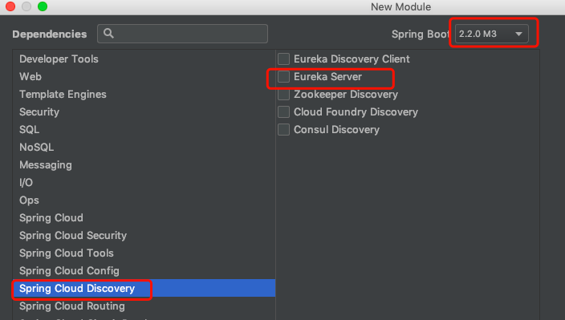
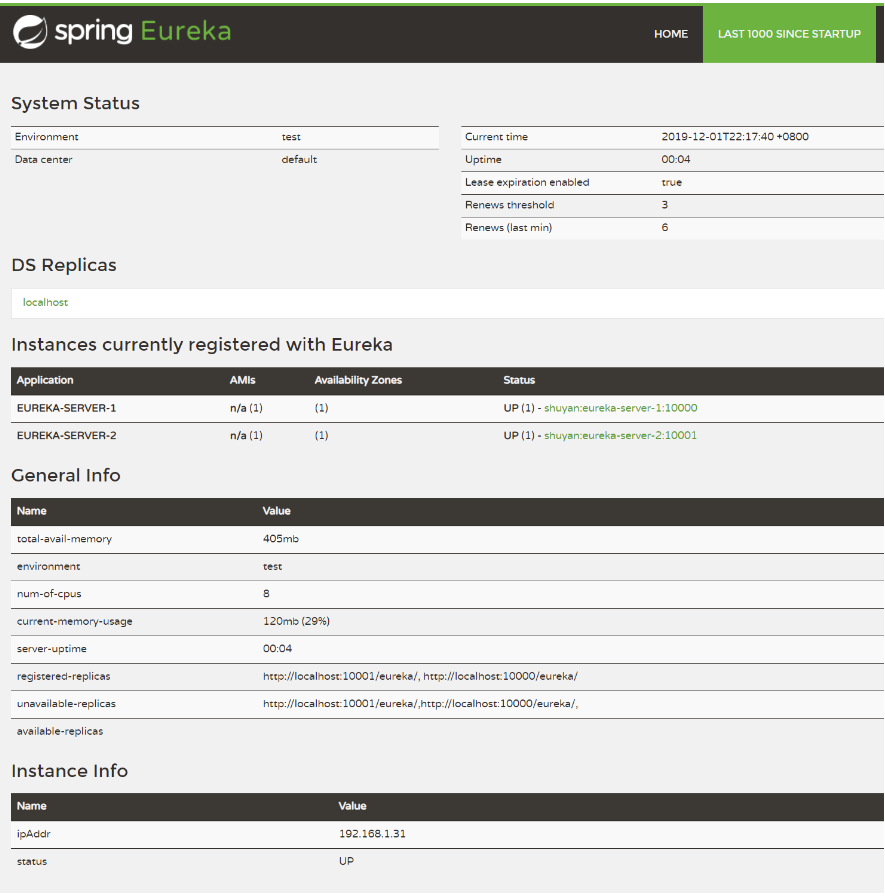
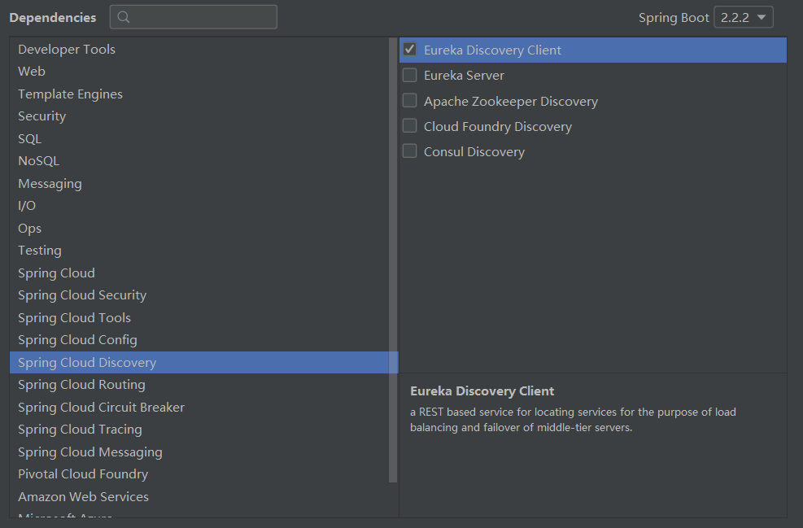
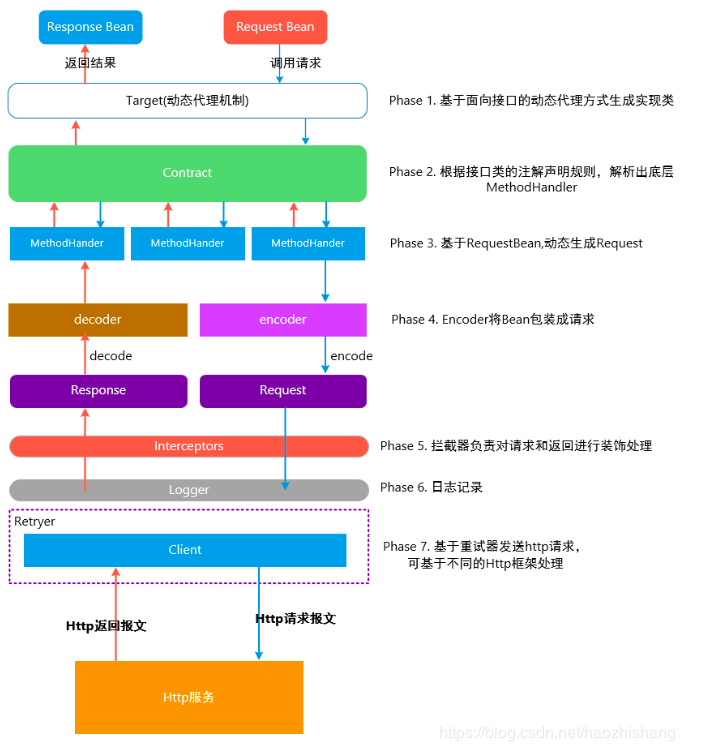

# springcloud

> + 参考资料
>   + [驰狼课堂springcloud视频教程](http://www.chilangedu.com/course/1606928230.html) 
> + [B站尚硅谷springcloud视频](https://www.bilibili.com/video/av22613028) 
>   
> + 前置知识：
>   + [Docker](../docker/README.md) 
>   + rancher

## 版本

+ `springboot`与`springcloud`之间存在版本对应关系，创建项目时，选择好`springboot`版本后，在选择其他组件时，就会自动匹配合适的`springcloud`版本

## Eureka

### 介绍

+ 用于服务注册发现
+ 分为服务端和客户端，服务端用于管理有哪些可用的服务，客户端用于将自己注册到服务端

### server

+ 创建moudle时选择`eureka`服务的server端

   

  这会自动引入如下依赖
  
  ```xml
  <dependency>
      <groupId>org.springframework.cloud</groupId>
      <artifactId>spring-cloud-starter-netflix-eureka-server</artifactId>
  </dependency>
  ```
  
+ 在启动类上增加`@EnableEurekaServer`注解，将该项目作为`eureka server`启动

+ `application.properties`

  ```properties
  server.port=20001
  spring.application.name=cloud-customer
  
  eureka.instance.prefer-ip-address=true
  eureka.instance.instance-id=${spring.cloud.client.ip-address}:${server.port}
  # 指定集群中所有eureka server节点
  eureka.client.service-url.defaultZone=http://localhost:10000/eureka
  ```

  > 很多课程会在本节课将`eureka.client.register-with-eureka`和`eureka.client.fetch-registry`设置为`false`；如果不设置，单个`eureka server`服务启动时，只能自己把自己注册到自己身上，但是在启动过程中会有几次注册不上，会产生几次报错，尝试几次就能注册上了；我觉得问题不大，可以不用设置

+ 启动项目，并访问http://localhost:10000，即可看见`springcloud`提供的集群中各节点信息管理界面

   

  + **DS Replicas**

    全称`discovery server replicas`，译为`发现服务副本`

    这里显示的内容，取决于`eureka.client.service-url.defaultZone`的配置，如该配置项配置为：

    ```properties
    eureka.client.service-url.defaultZone=http://peer1:10000/eureka,http://peer1:10001/eureka,http://peer2:10000/eureka
    ```

    则此处会显示2个副本：`peer1`，`peer2`，点击`peer1`时，会跳转带`peer1`主机上其中1个服务地址上

  + **Instances currently registered with Eureka**

    当前在集群的eureka服务上注册的所有实例

    + application

      该列显示每个实例的应用名称，可以通过`spring.application.name`和`eureka.instance.appname`进行配置，前者优先级更高

    + status

      该列显示每个实例的`instance ID`和实例状态

  + **General Info**

    当前实例基本状况

  + **Instancce Info**

    实例信息

### client

+ 创建`module`并选择`eureka`服务的client端

   

  这会自动引入如下依赖

  ```xml
  <dependency>
      <groupId>org.springframework.cloud</groupId>
      <artifactId>spring-cloud-starter-netflix-eureka-client</artifactId>
  </dependency>
  ```

+ 配置文件

  ```properties
  server.port=20001
  spring.application.name=cloud-customer
  
  eureka.instance.prefer-ip-address=true
  eureka.instance.instance-id=${spring.cloud.client.ip-address}:${server.port}
  # 指定集群中所有eureka server节点
  eureka.client.service-url.defaultZone=http://localhost:10000/eureka
  ```

### 配置文件

+ **spring.application.name**

  指定实例名称（优先级较高）；**推荐使用**

  这个必须指定，服务间通过实例名称找到对方

+ **eureka.instance.appname**

  指定实例名称（优先级较低）

+ **eureka.instance.prefer-ip-address**

  集群中各服务之间互相访问默认使用hostname进行，但是这样需要在各个机器上配置`hosts`文件，将该配置设为true，可以尽量使用`ip`进行通信

+ **eureka.instance.hostname**

  用于指定本机的主机名，当前实例以主机名的形式向外暴露地址时，主机名使用该值

  （初步觉得使用ip地址更好，该选项应该用不到）

+ **eureka.client.fetch-registry**

  是否从`eureka server`上获取信息

+ **eureka.client.register-with-eureka**

  是否注册到`eureka server`上

+ **eureka.client.serviceUrl.defaultZone**

  用于设置集群中所有`eureka server`节点的服务地址

+ **eureka.instance.instance-id**

  用于设置`Instance ID`

  `Instance ID`默认取值为：

  ```properties
  # 主机名;应用名:端口
  eureka.instance.instance-id=${spring.cloud.client.hostname}:${spring.application.name}:${server.port}}
  ```

  我们可以自行指定：

  ```properties
  # ip:port
  eureka.instance.instance-id=${spring.cloud.client.ip-address}:${server.port}
  ```

  这个`Instance ID`目前为止知道的作用仅是显示

### 简单的服务调用

+ 配置`RestTemplate`

  ```java
  @Bean
  public RestTemplate restTemplate(){
      return new RestTemplate();
  }
  ```

+ 服务提供方

  正常写接口

  ```java
  @RestController
  @RequestMapping("/user")
  public class UserController {
      @GetMapping("/name")
      public String getUserName(){
          return "tom";
      }
  }
  ```

+ 服务调用方

  ```java
  @Resource
  private EurekaClient eurekaClient;
  @Resource
  private RestTemplate restTemplate;
  
  @GetMapping("/customer/name")
  public String getCustomerName(){
      // 从eureka获取服务的地址
      InstanceInfo instanceInfo = eurekaClient.getNextServerFromEureka("cloud-producer", false);
      String homePageUrl = instanceInfo.getHomePageUrl();
      // 组装请求
      return restTemplate.getForObject(homePageUrl + "/user/name", String.class);
  }
  ```

### @EnableDiscoveryClient和@EnableEurekaClient

两者功能差不多，如果服务发现使用的是`eureka`，则使用`@EnableEurekaClient`，否则使用`@EnableDiscoveryClient`

## Ribbon

### 介绍

用于服务间负载均衡

### 使用

+ 依赖

  `eureka`的`server`和`client`端依赖中均包含了`ribbon`的依赖，这里不需要单独引入

+ 在声名`RestTemplate`的bean上加上`@LoadBalanced`注解

  ```java
  @Bean
  @LoadBalanced
  public RestTemplate restTemplate(){
    return new RestTemplate();
  }
  ```

+ 此时，`restTemplate`就具备了根据应用名称请求服务和负载均衡的能力

  ```java
  @Resource
  private RestTemplate restTemplate;
  
  @GetMapping("/customer/name")
  public String getCustomerName(){
    // 其中 cloud-producer 是服务提供者的应用名称
    return restTemplate.getForObject("http://cloud-producer/user/name", String.class);
  }
  ```

### Ribbon主要组件

#### IRule

指定负载均衡策略

**内置7种算法：**

> 根据我认为的从最差到最好的顺序进行排序，后3个应该不相上下，一般使用默认即可

+ **RandomRule**

  随机规则

+ **RoundRobinRule**

  轮训规则

+ **ReryRule**

  重试（先按照轮询规则获取服务，如果获取服务失败则在指定时间内进行重试)

+ **AvailabilityFilteringRule**

  先过滤掉不可用或处于高并发状态的服务，然后进行轮询

+ **WeightedResponseTimeRule**

  根据响应时间计算权重，选择响应最快的服务

  刚启动时因为统计信息不足，会先使用轮训策略

+ **BestAvailableRule**

  先过滤掉由于多次访问故障而处于断路器跳闸状态的服务，然后选择一个并发量最小的服务

+ **ZoneAvoidanceRule**

  ==默认规则==

  复合判断Server所在区域的性能和Server的可用性选择服务器

#### IPing

如何检查应用是否还活着

**内置5种实现**

+ **NoOpPing**

  永远返回true

+ **PingConstant**

  指定什么就返回什么

+ **DummyPing**

  ==默认实现==

  也是永远返回true

+ **NIWSDiscoveryPing**

  不执行真正的ping，以服务发现客户端认为的状态为准

+ **PingUrl**

  执行真正的ping，以ping命令的结果为准

#### ServerList

用于获取服务列表

**内置4种实现**

+ **StaticServerList**

  静态服务列表

+ **ConfigurationBasedServerList**

  从配置文件中获取服务列表

  ```properties
  <clientName>.ribbon.listOfServers=www.microsoft.com:80,www.yahoo.com:80,www.google.com:80
  ```

+ **DiscoveryEnabledNIWSServerList**

  从Eureka Client中获取服务列表。此值必须通过属性中的VipAddress来标识服务器集群

+ **DomainExtractingServerList**

  代理类，根据ServerList的值实现具体的逻辑

  ==默认实现是使用该类代理DiscoveryEnabledNIWSServerList== 

#### ServerListFilter

对服务列表进行过滤

**内置4实现**

+ **ZoneAffinityServerListFilter**

  过滤掉所有的不和客户端在相同zone的服务，如果和客户端相同的zone不存在，才不过滤不同zone有服务

+ **DefaultNIWSServerListFilter**

  跟`ZoneAffinityServerListFilter`一模一样，重写了，但是没有重写任何方法

+ **ZonePreferenceServerListFilter**

  ==默认实现==

  `ZoneAffinityServerListFilter`的子类。和``ZoneAffinityServerListFilter`相似，但是比较的zone是发布环境里面的zone。过滤掉所有和客户端环境里的配置的zone的不同的服务，如果和客户端相同的zone不存在，才不进行过滤。

+ **ServerListSubsetFilter**

  `ZoneAffinityServerListFilter`的子类。此过滤器确保客户端仅看到由ServerList实现返回的整个服务器的固定子集。 它还可以定期用新服务器替代可用性差的子集中的服务器。

#### ServerListUpdater

用于动态的更新服务列表。

**内置2种实现**

+ **PollingServerListUpdater**

  ==默认实现==

  启动一个定时线程池，定时（默认30s）执行更新策略

+ **EurekaNotificationServerListUpdater**

  当收到缓存刷新的通知，会更新服务列表。

#### IClientConfig

用于定义包括上述5种组件的配置信息

目前只有1个实现：**DefaultClientConfigImpl**

#### ILoadBalancer

负载均衡调度器，用于使用上面配置的5种组件统一进行调度

**内置4种实现**

+ **NoOpLoadBalancer**

  不做任何操作的调度器（不用管，谁会用这样的调度器）

+ **BaseLoadBalancer**

+ **DynamicServerListLoadBalancer**

  组合Rule、IPing、ServerList、ServerListFilter、ServerListUpdater 实现类，实现动态更新和过滤更新服务列表

+ **ZoneAwareLoadBalancer**

  ==默认实现== 

  这是DynamicServerListLoadBalancer的子类，主要加入zone的因素。统计每个zone的平均请求的情况，保证从所有zone选取对当前客户端服务最好的服务组列表

### 如何进行的默认配置

+ 在`RibbonClientConfiguration`中使用`ZoneAvoidanceRule`配置了1个类型为`IRule`的Bean，但是经过测试，这个Bean并不是启动的时候就加载的，是在调用了`restTemplate`之后才加载
+ 经过debug发现，调用`restTemplate.getForObject`方法后，执行了`SpringClientFactory`的父类`NamedContextFactory`的`createContext`方法（108行）；在该类中维护了1个用于维护**应用上下文**的Map集合，key是要请求的服务的应用名，value是请求该服务时使用的应用上下文，而每个服务使用的负载均衡策略（类型为`IRule`的bean）就被注册到了这些上下文中。这些上下文与`applicationContext`是独立的，所以，是无法在代码中使用`@Resource`注入的。

### 配置Ribbon

+ 全局

  + 注解

    使用`@RibbonClients`注解的`defaultConfiguration`属性配置（不仅限于IRule）

    ```
    @RibbonClients(defaultConfiguration = BestAvailableRule.class)
    ```

  + 配置类

    被应用上下文扫描到的，关于ribbon相关的Bean会被作为默认配置

    ```java
    @Bean
    public IRule iRule(){
      return new BestAvailableRule();
    }
    ```

+ 为每个单独配置

  + 注解

    使用`@RibbonClient`为1个应用指定配置（不仅限于IRule）

    ```java
    @RibbonClient(value = "cloud-producer",configuration = BestAvailableRule.class)
    ```

    当需要为多个应用指定时，需要与`@RibbonClients`注解结合使用

    ```java
    @RibbonClients(defaultConfiguration = WeightedResponseTimeRule.class,
            value = {
                    @RibbonClient(value = "cloud-producer", configuration = BestAvailableRule.class)
            })
    ```

    **注意：如果需要单独定义配置某个应用的Ribbon配置时，不要被应用上下文扫描到（不要放在可扫描包下，或使用`@Configuration`等注解），否则会作为全局配置**

  + 配置文件

    ribbon相关配置可以通过`<clientName>.<nameSpace>.<property>`进行配置，其中：

    clientName：应用名称

    nameSpace：ribbon配置使用的命名空间（专用的应用上下文），默认`ribbon`

    property：可以配置的属性

    + NFLoadBalancerClassName：
    + NFLoadBalancerRuleClassName
    + NFLoadBalancerPingClassName
    + NIWSServerListClassName
    + NIWSServerListFilterClassName

    举个🌰：

    ```properties
    # 配置负载均衡策略
    <clientName>.ribbon.NFLoadBalancerRuleClassName=com.netflix.loadbalancer.BestAvailableRule
    ```

## Feign

### 介绍

声名式远程服务调用，用于使用注解调用远程接口

### 使用

+ 引入依赖

  也可在创建项目时选择`openfeign`

  ```xml
  <dependency>
    <groupId>org.springframework.cloud</groupId>
    <artifactId>spring-cloud-starter-openfeign</artifactId>
  </dependency>
  ```

+ 在启动类上增加`@EnableFeignClients`注解，启用feign功能

+ 使用`@FeignClient`注解对其他服务提供的接口进行声名

  ```java
  /**
   * @author shuyan
   */
  @FeignClient("cloud-producer")
  public interface UserFeignClient {
      /**
       * 获取用户名
       * @return 用户名
       */
      @GetMapping("/user/name")
      String getUserName(@RequestParam("id") Integer id);
  }
  ```

+ 调用服务

  ```java
  @Resource
  private UserFeignClient userFeignClient;
  
  @GetMapping("/customer/name")
  public String getCustomerName(){
    return userFeignClient.getUserName(1);
  }
  ```

  **注意：使用`FeignClient`传递参数时，必须使用`@RequestParam`等注解对请求参数进行标注，pojo类必须使用`@RequestBody`进行标注（包括get请求）；并且可以指定参数名称的，必须指定参数名称（如：`@RequestParam("id")`）** 

### @FeignClient注解

+ 只能作用在接口或类上

+ 属性

  + name

    指定应用名称

  + value

    `name`属性的别名

  + serverId

    与`name`属性作用相同，已弃用

  + contextId

    当项目中存在两个同类名的`FeignClient`时，会以相同的bean名称进行注册，此时会报错：

    ```java
    The bean 'cloud-producer.FeignClientSpecification' could not be registered. A bean with that name has already been defined and overriding is disabled.
    Action:
    Consider renaming one of the beans or enabling overriding by setting spring.main.allow-bean-definition-overriding=true
    ```

    此时可以使用该属性将这个bean指定为其他名称，即可避免冲突

  + qualifier

    使用该属性指定1个值后，使用`@Qualifier`注解进行注入时，可以使用该值注入

  + url

    url属性一般用于调试程序，允许我们手动指定@FeignClient调用的地址

  + decode404

    默认情况下，当从1个接口调用1个不存在的服务时，那个服务返回404，这个接口返回的是500

    当`decode404`设置true时，会对服务返回的信息进行解析，如果服务返回404，则接口也返回404

    使用此功能需要配置`feign`的`decoder`

  + configuration

    用于单独指定这个`feignClient`的配置类

  + fallBack

    定义容错的处理类，当调用远程接口失败或超时时，会调用对应接口的容错逻辑，fallback指定的类必须实现@FeignClient标记的接口

    ==详情参见Hystrix相关内容==

  + fallbackFactory

    用于生成fallback类示例，通过这个属性我们可以实现每个接口通用的容错逻辑，减少重复的代码

    ==详情参见Hystrix相关内容==

  + path

    指定路径的统一前缀，对应controller上面的`@RequestMapping`指定的路径

  + primary

    是否作为主bean，应该是bean出现冲突时使用的，先不管他

### @RequestLine

不建议使用

+ 作用

  指定声名的接口的请求方法及路径

  ```java
  @RequestLine("GET /user/info")
  # 相当于
  @GetMapping("/user/info")
  ```

+ 需要全局配置`Contract`

  ```java
  @Bean
  public Contract contract(){
    // 这样配置后，只能使用 @RequestLine 注解了
    return new feign.Contract.Default();
  }
  ```

### FeignClient相关组件

> 参考资料：[feign自定义组件（2）](https://blog.csdn.net/haozhishang/article/details/93882865) 

#### Encoder

用于编码如何向**请求体**中封装请求，默认`SpringEncoder`，默认就好

#### Decoder

当响应状态码为**2xx**时，将响应转为需要的类型的对象

默认实现：

```java
new OptionalDecoder(new ResponseEntityDecoder(new SpringDecoder(this.messageConverters)))
```

这种链式构造，目的是当`OptionalDecoder`无法解码时，使用`ResponseEntityDecoder`解码，再无法解码时，使用`SpringDecoder`解码

#### LogLevel

+ 默认实现类：Slf4jlogger

+ 日志级别

  NONE：不做任何记录（默认）

  BASIC：只记录输出Http 方法名称、请求URL、返回状态码和执行时间

  HEADERS：记录输出Http 方法名称、请求URL、返回状态码和执行时间 和 Header 信息

  FULL：记录Request 和Response的Header，Body和一些请求元数据

#### Contract

用于将接口中定义的注解、参数等转换为http协议需要的元数据

默认实现：`SpringMvcContract`

#### Retryer

重试器，当HTTP请求出现IO异常时，Feign会有一个最大尝试次数发送请求

默认实现：`Retryer.NEVER_RETRY`

#### ErrorDecoder

当响应状态码不是**2xx**时，将响应转为`Exception`异常

默认实现：`ErrorDecoder.Default`

#### RequestInterceptor

+ 作用

  请求拦截器，用于在请求发出之前，对请求进行配置

+ 实现类

  + BaseRequestInterceptor

    定义了addHeader方法，往requestTemplate添加非重名的header

  + FeignAcceptGzipEncodingInterceptor

    + 用于告诉服务提供者，你可以使用指定的压缩哟格式对响应进行压缩再回传
    + 继承了BaseRequestInterceptor，它的apply方法往RequestTemplate添加了名为`Accept-Encoding`，值为gzip,deflate的header
    + 原理参见`Accept-Encoding`请求头作用

  + FeignContentGzipEncodingInterceptor

    + 告诉服务提供者，我使用指定的格式对请求进行了压缩
    + 继承了BaseRequestInterceptor，其apply方法先判断是否需要compression，即mimeType是否符合要求以及content大小是否超出阈值，需要compress的话则添加名为`Content-Encoding`，值为gzip,deflate的header
    + 具体在哪进行的压缩暂时未找到

  + BasicAuthRequestInterceptor

    + 使用指定的用户名密码，使用Basic认证的方式生成`Authorization`请求头

+ 配置文件启用压缩

  使用`feign.compression`相关配置

+ 自定义`RequestInterceptor`传递请求头

  ```java
/**
  * 将接收到的 X-Auth-Token 请求头传递下去
  */
  @Bean
  public RequestInterceptor headerInterceptor() {
    return requestTemplate -> {
      ServletRequestAttributes attributes = (ServletRequestAttributes) RequestContextHolder
        .getRequestAttributes();
      if (attributes == null) {
        return;
      }
      HttpServletRequest request = attributes.getRequest();
      String token= request.getHeader("X-Auth-Token");
      if (!StringUtils.isEmpty(token)) {
        requestTemplate.header("X-Auth-Token", token);
      }
    };
  }
  ```

### 配置feign

#### 配置类

+ 全局

  直接在配置类中声名Bean

+ 单独

  在没有被扫描进`application context`的类中声名bean

  ```java
  public class MyFeignClientConfiguration {
  
      @Bean
      public Retryer retryer(){
          return new Retryer.Default();
      }
  }
  ```

  使用`@FeignClient`的`configuration`属性指定该客户端的配置

  ```java
  @FeignClient(value = "provider",path = "/user",configuration = MyFeignClientConfiguration.class)
  ```

#### 配置文件

源码参见`FeignClientProperties`，可配置属性都在这里

+ 全局：使用`feign.default`进行配置
+ 单独：使用`feign.<clientName>`进行配置

#### 配置加载顺序

参见`FeignClientFactoryBean.configureFeign()`方法

```java
protected void configureFeign(FeignContext context, Feign.Builder builder) {
		FeignClientProperties properties = this.applicationContext
				.getBean(FeignClientProperties.class);
		if (properties != null) {
             /**
              * 下面主要是设值的优先级
              */
			if (properties.isDefaultToProperties()) {
                 //先将子容器中存在bean设入builder中
				configureUsingConfiguration(context, builder);
                 //加载默认的属性值替换刚刚设入builder的值
				configureUsingProperties(
						properties.getConfig().get(properties.getDefaultConfig()),
						builder);
                 //加载对应contextId(这个就是@FeignClient里面的contextId属性)的配置替换刚刚设入builder的值
				configureUsingProperties(properties.getConfig().get(this.contextId),
						builder);
			}
			else {
                 //同上
				configureUsingProperties(
						properties.getConfig().get(properties.getDefaultConfig()),
						builder);
				configureUsingProperties(properties.getConfig().get(this.contextId),
						builder);
				configureUsingConfiguration(context, builder);
			}
		}
		else {
			configureUsingConfiguration(context, builder);
		}
	}
```

### 调用流程

 

### 指定feign扫描包路径

+ 当需要将`@FeignClient`标注的接口类抽离出来时，由于跨包，无法被应用上下文扫描到

+ 但是由于`@FeignClient`标注的是接口，无法实例化，所以使用常规的`@ComponentScan`注解指定扫描路径，是无效的

+ 此时可以使用`@EnableFeignClients`注解指定扫描路径

  ```java
  @EnableFeignClients("com.learn.cloud.common.feign")
  ```

### Feign类型转换器

```java
@Component
public class FeignFormatterRegister implements FeignFormatterRegistrar {

    @Override
    public void registerFormatters(@NonNull FormatterRegistry registry) {
        registry.addConverter(Instant.class, String.class, new Instant2StringConverter());
    }

    private class Instant2StringConverter implements Converter<Instant,String> {
        @Override
        public String convert(@NonNull Instant source) {
            return source.toString();
        }
    }
}
```

### 踩坑记录

#### GET请求使用Pojo类传递参数报405

加入如下依赖

```xml
<dependency>
  <groupId>io.github.openfeign</groupId>
  <artifactId>feign-httpclient</artifactId>
</dependency>
```

#### Date传参相差14小时

+ 问题

  get请求直接使用请求参数传递Date类型请求参数时，接到的时间会相差14小时，而使用pojo类传参则不会

+ 解决方案

  注册1个类型转换器，指定如何将Date类型转换为字符串

  另外建议使用`Instant`传递时间，而不是`Date`

## Sentinel

### 介绍

+ 由于`Hystrix`已停止更新，需要使用其他产品替换，`Hystrix`官方推荐`resilience4j`，但是很多人选择了`Alibaba`的`Sentinel`，对比3者的`github`星数，果断选择`sentinel`

  + hystrix：18.8k
  + resilience4j：4.8k
  + sentinel：10.2k

+ 断路器

  上述3种中间件都是断路器

  如果A服务出现问题，B服务请求A服务，则B服务也会阻塞住，C调用B时，C也会阻塞住，这样造成`雪崩`效应，导致整个集群瘫痪

  熔断器的作用就是，当1个服务不可用时，即时放弃请求，避免蔓延到整个集群

### 使用


## 技巧

### module间共用配置类

`common`模块的配置类想要在其他进行引用时，由于`application context`是相互独立的，无法生效

> + 可以使用`@Import`注解，将需要的配置类引入自己的应用上下文
>
> + 也可以使用`@ComponentScan`注解扫描某包下的bean
>
>   但是该注解不能用在启动类上，否则原来的包路径就无法扫描到了
>
>   该注解必须与`@Configuration`一起使用，否则无法生效

### 不扫描某类

使用`@ComponentScan`注解的`excludeFilters`属性进行排除


